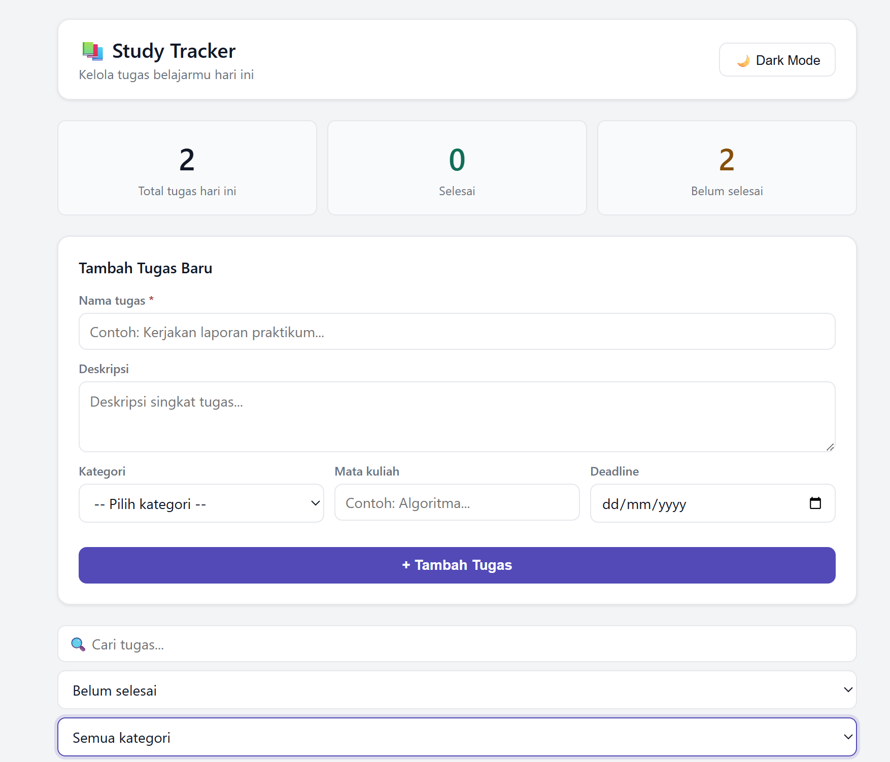

# Study Tracker

> Aplikasi web ringan untuk mengelola dan memantau tugas belajar harian mahasiswa — tanpa server, tanpa instalasi.


---

## Deskripsi

**Study Tracker** adalah aplikasi web berbasis browser yang membantu mahasiswa mencatat, mengelola, dan memantau tugas belajar mereka. Aplikasi berjalan sepenuhnya di sisi klien (*client-side*) — tidak memerlukan backend, database, maupun koneksi internet.

Semua data tersimpan secara otomatis di **localStorage** browser sehingga tidak hilang meskipun halaman ditutup.

---

## Screenshot

### Tampilan Utama — Form & Statistik
)

### Tampilan Daftar Tugas


---

## Fitur

| # | Fitur | Keterangan |
|:---:|---|---|
| 1 | Tambah Tugas | Lengkap dengan judul, deskripsi, kategori, mata kuliah, dan deadline |
| 2 | Toggle Selesai | Tandai tugas selesai / belum selesai dengan satu klik |
| 3 | Hapus Tugas | Hapus tugas yang sudah tidak diperlukan |
| 4 | Pencarian | Cari tugas secara *real-time* berdasarkan judul, deskripsi, atau mata kuliah |
| 5 | Filter | Filter berdasarkan **status** (selesai/belum) dan **kategori** |
| 6 | Statistik Harian | Ringkasan total tugas, selesai, dan belum selesai hari ini |
| 7 | Penanda Deadline | Tugas yang melewati deadline otomatis ditandai merah |
| 8 | Dark Mode | Mode gelap yang tersimpan otomatis di browser |
| 9 | Responsif | Tampilan nyaman di desktop maupun mobile |
| 10 | Auto-Save | Data tersimpan permanen via localStorage |

---

## Kategori Tugas

| Kategori | Contoh Penggunaan |
|---|---|
| Mata Kuliah | Tugas mingguan, PR, latihan soal |
| Praktikum | Laporan praktikum, jobsheet |
| Proyek | Proyek akhir, capstone, skripsi |
| Ujian | Belajar UTS, UAS, kuis |
| Membaca | Rangkuman materi, baca jurnal |
| Lainnya | Kegiatan akademik lainnya |

---

## Teknologi

| Teknologi | Fungsi |
|---|---|
| HTML5 | Struktur halaman dan elemen antarmuka |
| CSS3 + CSS Variables | Tampilan visual, Dark Mode, dan responsivitas |
| JavaScript ES6+ | Logika aplikasi dan manipulasi DOM |
| Web localStorage API | Penyimpanan data persisten di browser |
| Event Delegation | Pengelolaan event pada daftar tugas dinamis |

---

## Struktur Folder

```
WEBSITE/
├── css/
│   └── style.css       # Seluruh gaya tampilan & Dark Mode
├── js/
│   ├── storage.js      # Baca & tulis data ke localStorage
│   ├── render.js       # Render daftar tugas & statistik ke DOM
│   └── app.js          # Entry point, event listener, & logika utama
└── index.html          # Halaman utama aplikasi
```

### Peran Setiap Modul JS

| File | Tanggung Jawab |
|---|---|
| `js/storage.js` | Semua operasi CRUD ke localStorage (get, save, add, toggle, delete) |
| `js/render.js` | Render HTML daftar tugas, format tanggal, dan update angka statistik |
| `js/app.js` | Entry point: event listener, filter, pencarian, dark mode, dan `refreshUI()` |

---

## Cara Menjalankan

Tidak diperlukan instalasi apapun. Cukup buka file `index.html` di browser.

### Persyaratan

| Kebutuhan | Keterangan |
|---|---|
| Browser | Chrome, Firefox, Edge, atau Safari (versi terbaru) |
| Server | Tidak diperlukan |
| Internet | Tidak diperlukan |
| Node.js / Python | Tidak diperlukan |

### Cara A — Buka Langsung di Browser

1. Download atau clone repositori ini:
   ```bash
   git clone https://github.com/username/study-tracker.git
   ```
2. Masuk ke folder project:
   ```bash
   cd study-tracker
   ```
3. Klik dua kali pada file `index.html`, atau klik kanan → **Open with** → pilih browser.

### Cara B — Via Live Server (VS Code)  Direkomendasikan

1. Buka folder project di **Visual Studio Code**
2. Install ekstensi [Live Server](https://marketplace.visualstudio.com/items?itemName=ritwickdey.LiveServer)
3. Klik kanan pada `index.html` → pilih **Open with Live Server**
4. Aplikasi terbuka otomatis di `http://127.0.0.1:5500`

---

##  Catatan Penting

| Masalah | Solusi |
|---|---|
| Aplikasi tidak tampil / script error | Pastikan struktur folder sudah benar, tidak ada subfolder `js/js/` |
| Data hilang setelah ditutup | Pastikan tidak menggunakan mode private / incognito |
| Data tidak muncul di browser lain | localStorage bersifat lokal — tidak tersinkronisasi antar perangkat |
| Tugas lama tidak muncul | Cek filter status, pastikan pilih **"Semua status"** |

